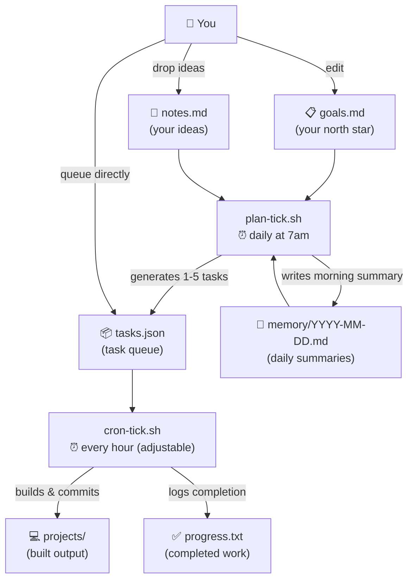

# RawrBot


An autonomous agent workspace. The agent plans its own work daily, executes tasks on a regular schedule, and evolves its understanding of what to build over time.

## How It Works



## Getting Started

1. **Clone the repo** and `cd` into it.

2. **Configure your workspace path:**

   ```bash
   cp .env.example .env
   # Edit .env and set WORKDIR to the absolute path of this repo
   ```

3. **Install [Claude Code](https://github.com/anthropics/claude-code)** - the scripts invoke `claude` directly.

4. **Set up cron jobs:**

   ```bash
   crontab -e
   ```

   Add:

   ```
   0 * * * * /path/to/scripts/cron-tick.sh >> /path/to/cron.log 2>&1
   0 7 * * * /path/to/scripts/plan-tick.sh >> /path/to/cron.log 2>&1
   ```

5. **Create `goals.md`** - describe what you want the agent to build. See the [Files](#files) section below.

6. _(Optional)_ **Start the Telegram listener** for remote task queueing:
   ```bash
   ./scripts/start-telegram.sh
   ```

## Files

| File                   | Purpose                                                                                     |
| ---------------------- | ------------------------------------------------------------------------------------------- |
| `goals.md`             | Agent's north star - what to build, priorities, constraints. Edit freely.                   |
| `notes.md`             | Your scratchpad - drop ideas here, the agent converts actionable ones to tasks each morning |
| `tasks.json`           | Task queue - appended to by the planner, executed by the cron agent                         |
| `progress.txt`         | Log of completed work                                                                       |
| `MEMORY.md`            | Long-term agent memory                                                                      |
| `memory/YYYY-MM-DD.md` | Daily notes - morning plan + session summaries                                              |
| `projects/`            | Agent-created projects live here                                                            |
| `cron.log`             | Output from both cron scripts                                                               |

## Steering the Agent

**Drop an idea** - add it to `notes.md` in plain English, the planning agent will pick it up tomorrow morning:

```
build a CLI tool that summarises my git activity for the week
```

**Queue a task immediately (in Claude Code)** - use the `/add-task` skill:

```
/add-task build a CLI tool that summarises my git activity for the week
```

Claude will parse your input, preview the entries, and ask for confirmation before writing.

Or add directly to `tasks.json`:

```json
{
  "id": "my-task-id",
  "category": "feature",
  "description": "What you want built",
  "steps": ["step 1", "step 2"],
  "passes": false,
  "priority": 1,
  "addedBy": "user",
  "addedAt": "2026-03-22T00:00:00Z"
}
```

**Update priorities or constraints** - edit `goals.md` directly. The agent reads it on every planning tick and respects changes immediately.

**Trigger a manual run**:

```bash
# Run one execution tick now
./scripts/task-tick.sh

# Run the planning tick now
./scripts/plan-tick.sh
```

## Cron Schedule

| Schedule     | Script         | What it does                                 |
| ------------ | -------------- | -------------------------------------------- |
| Every hour   | `cron-tick.sh` | Executes the next pending task               |
| Daily at 7am | `plan-tick.sh` | Generates new tasks + writes morning summary |

To view or edit:

```bash
crontab -e
```

### Alternative: `/loop` in Claude Code

Instead of system cron, you can drive the agent from within a Claude Code session using the `/loop` command:

```
/loop 1h ./scripts/task-tick.sh
```

This runs the execution tick every hour for as long as the session is open - no crontab required. Useful for short bursts of supervised work or when testing changes to the tick scripts.

## Token-Saving Strategies

The agent is designed to keep each Claude invocation cheap:

- **Queue cap** - new tasks are only generated when fewer than 3 are pending, preventing runaway queue growth
- **No `CLAUDE.md`** - the workspace deliberately omits a `CLAUDE.md` file so no extra content is injected into every context window
- **Truncated history** - `progress.txt` is injected tail-only (50 lines for execution, 100 for planning), not in full
- **Projects listing, not contents** - the planner only injects top-level directory names from `projects/`, not file trees or file contents
- **Single-shot invocations** - both cron scripts use `claude -p` (non-interactive), so no conversation history accumulates across turns
- **Concise progress logging** - agents are explicitly instructed to "sacrifice grammar for concision" in `progress.txt`
- **MEMORY.md as index** - only the summary index is injected per tick; full memory files are read on demand, not always loaded

## Task Schema

```json
{
  "id": "unique-slug",
  "description": "What to build or do",
  "steps": ["step 1", "step 2"],
  "category": "agent-generated",
  "reasoning": "Why this was chosen (agent-generated tasks only)",
  "passes": false,
  "priority": 1,
  "addedBy": "agent | user",
  "addedAt": "2026-03-22T07:00:00Z"
}
```

`passes: false` = pending. The agent sets it to `true` when complete.
