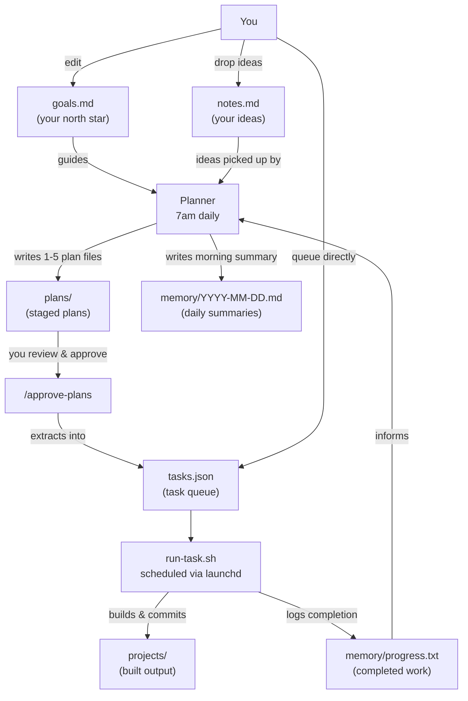

# RawrBot


An autonomous agent workspace. The agent plans its own work daily, executes tasks on a regular schedule, and evolves its understanding of what to build over time.

## How It Works



## Getting Started

1. **Clone the repo** and `cd` into it.

2. **Install [Claude Code](https://github.com/anthropics/claude-code)** - the scripts invoke `claude` directly.

3. **Run `/setup`** in a Claude Code session - it will create all required files with examples and install the launchd agents.

4. **Try it out** - queue your first task and watch it execute:
   ```
   /add-task build a hello world CLI tool
   /run-task
   ```

5. _(Optional)_ **Start the Telegram listener** for remote task queueing:
   ```bash
   ./scripts/start-telegram.sh
   ```

## Files

| File                   | Purpose                                                                                     |
| ---------------------- | ------------------------------------------------------------------------------------------- |
| `goals.md`             | Agent's north star - what to build, priorities, constraints. Edit freely.                   |
| `notes.md`             | Your scratchpad - drop ideas here, the agent converts actionable ones to tasks each morning |
| `plans/`               | Staged plan files from the planner - review then `/approve-plans` to extract into tasks.json |
| `tasks.json`           | Task queue - populated via `/approve-plans` or `/add-task`, executed by the task agent       |
| `memory/progress.txt`  | Log of completed work                                                                       |
| `memory/index.md`      | Long-term agent memory                                                                      |
| `memory/YYYY-MM-DD.md` | Daily notes - morning plan + session summaries                                              |
| `projects/`            | Agent-created projects live here                                                            |
| `launchd/`             | Plist files for launchd scheduling                                                          |
| `cron.log`             | Output from scheduled scripts                                                               |

## Skills

| I want to...                    | Use this             |
|---------------------------------|----------------------|
| Dump a vague idea for later     | Add to `notes.md`    |
| Shape an idea into a plan       | `/add-plan`          |
| Queue exact work immediately    | `/add-task`          |
| Review and approve staged plans | `/approve-plans`     |
| Trigger the planner manually    | `/run-plan`          |
| Execute the next task manually  | `/run-task`          |
| Check system status             | `/status`            |
| Generate a project README       | `/create-readme`     |
| First-time workspace setup      | `/setup`             |

## Steering the Agent

There are three ways to feed work into the agent, from passive to direct:

**1. Drop an idea in `notes.md`** - write it in plain English, the planning agent picks it up on its next tick and converts it into a plan for review:

```
build a CLI tool that summarises my git activity for the week
```

**2. Shape an idea with `/add-plan`** - interactively refine a rough concept into a structured plan. You can either stage it in `plans/` for batch review or promote it straight to the task queue:

```
/add-plan build a CLI tool that summarises my git activity for the week
```

**3. Queue work directly with `/add-task`** - skip the planning stage entirely and add a task straight to `tasks.json`:

```
/add-task build a CLI tool that summarises my git activity for the week
```

**Update priorities or constraints** - edit `goals.md` directly. The agent reads it on every planning tick and respects changes immediately.

**Review staged plans** - run `/approve-plans` to see plan files from `plans/`, approve, edit, or reject them before extracting into `tasks.json`.

**Trigger agents manually** - run `/run-plan` to generate plans on demand, or `/run-task` to execute the next pending task.

### Alternative: `/loop` in Claude Code

Instead of launchd, you can drive the agent from within a Claude Code session using the `/loop` command:

```
/loop 1h /run-task
```

This runs the execution tick every hour for as long as the session is open - no launchd required. Useful for short bursts of supervised work or when testing changes to the tick scripts.

### Managing Schedules

Schedules are managed via launchd (macOS Launch Agents). Plist files live in `launchd/` and are symlinked to `~/Library/LaunchAgents/` on install.

```bash
./scripts/launchd.sh install    # Install and load all agents
./scripts/launchd.sh uninstall  # Unload and remove all agents
./scripts/launchd.sh status     # Check which agents are loaded
```

## Token-Saving Strategies

The agent is designed to keep each Claude invocation cheap:

- **Queue cap** - new tasks are only generated when fewer than 3 are pending, preventing runaway queue growth
- **No `CLAUDE.md`** - the workspace deliberately omits a `CLAUDE.md` file so no extra content is injected into every context window
- **Truncated history** - `memory/progress.txt` is injected tail-only (50 lines for execution, 100 for planning), not in full
- **Projects listing, not contents** - the planner only injects top-level directory names from `projects/`, not file trees or file contents
- **Single-shot invocations** - both cron scripts use `claude -p` (non-interactive), so no conversation history accumulates across turns
- **Concise progress logging** - agents are explicitly instructed to "sacrifice grammar for concision" in `progress.txt`
- **`memory/index.md` as index** - only the summary index is injected per tick; full memory files are read on demand, not always loaded

## Keeping Your Mac Awake

Install [Caffeine](https://www.caffeine.app/) with `brew install --cask caffeine`.

If running the agent via `/loop` or cron during an extended session, prevent your Mac from sleeping with:

```bash
caffeinate -s
```

Also ensure your Mac is plugged in and not on battery.
