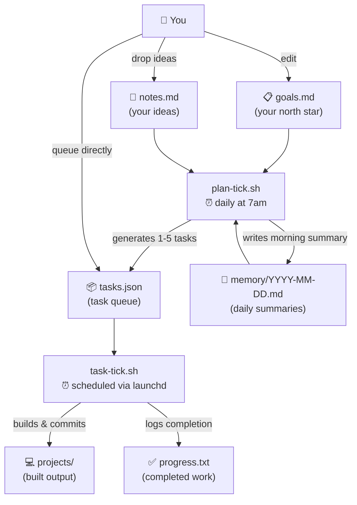

# RawrBot


An autonomous agent workspace. The agent plans its own work daily, executes tasks on a regular schedule, and evolves its understanding of what to build over time.

## How It Works



## Getting Started

1. **Clone the repo** and `cd` into it.

2. **Install [Claude Code](https://github.com/anthropics/claude-code)** - the scripts invoke `claude` directly.

3. **Run `/setup`** in a Claude Code session - it will create all required files with examples and install the launchd agents.

4. _(Optional)_ **Start the Telegram listener** for remote task queueing:
   ```bash
   ./scripts/start-telegram.sh
   ```

## Files

| File                   | Purpose                                                                                     |
| ---------------------- | ------------------------------------------------------------------------------------------- |
| `goals.md`             | Agent's north star - what to build, priorities, constraints. Edit freely.                   |
| `notes.md`             | Your scratchpad - drop ideas here, the agent converts actionable ones to tasks each morning |
| `tasks.json`           | Task queue - appended to by the planner, executed by the task agent                         |
| `progress.txt`         | Log of completed work                                                                       |
| `MEMORY.md`            | Long-term agent memory                                                                      |
| `memory/YYYY-MM-DD.md` | Daily notes - morning plan + session summaries                                              |
| `projects/`            | Agent-created projects live here                                                            |
| `launchd/`             | Plist files for launchd scheduling                                                          |
| `cron.log`             | Output from scheduled scripts                                                               |

## Steering the Agent

**Drop an idea** - add it to `notes.md` in plain English, the planning agent will pick it up tomorrow morning:

```
build a CLI tool that summarises my git activity for the week
```

**Queue a task immediately (in Claude Code)** - use the `/add-task` skill:

```
/add-task build a CLI tool that summarises my git activity for the week
```

Claude will parse your input, preview the entries, and ask for confirmation before writing.

**Update priorities or constraints** - edit `goals.md` directly. The agent reads it on every planning tick and respects changes immediately.

**Trigger a planning tick manually** - use the `/plan-tick` skill:

```
/plan-tick
```

Runs the morning planning agent on demand - reads `goals.md`, `notes.md`, and recent memory, then generates new tasks.

**Trigger an execution tick manually** - use the `/task-tick` skill:

```
/task-tick
```

Picks the highest-priority pending task from `tasks.json` and executes it.

### Alternative: `/loop` in Claude Code

Instead of launchd, you can drive the agent from within a Claude Code session using the `/loop` command:

```
/loop 1h /task-tick
```

This runs the execution tick every hour for as long as the session is open - no launchd required. Useful for short bursts of supervised work or when testing changes to the tick scripts.

### Managing Schedules

Schedules are managed via launchd (macOS Launch Agents). Plist files live in `launchd/` and are symlinked to `~/Library/LaunchAgents/` on install.

```bash
./scripts/launchd.sh install    # Install and load all agents
./scripts/launchd.sh uninstall  # Unload and remove all agents
./scripts/launchd.sh status     # Check which agents are loaded
```

## Token-Saving Strategies

The agent is designed to keep each Claude invocation cheap:

- **Queue cap** - new tasks are only generated when fewer than 3 are pending, preventing runaway queue growth
- **No `CLAUDE.md`** - the workspace deliberately omits a `CLAUDE.md` file so no extra content is injected into every context window
- **Truncated history** - `progress.txt` is injected tail-only (50 lines for execution, 100 for planning), not in full
- **Projects listing, not contents** - the planner only injects top-level directory names from `projects/`, not file trees or file contents
- **Single-shot invocations** - both cron scripts use `claude -p` (non-interactive), so no conversation history accumulates across turns
- **Concise progress logging** - agents are explicitly instructed to "sacrifice grammar for concision" in `progress.txt`
- **MEMORY.md as index** - only the summary index is injected per tick; full memory files are read on demand, not always loaded

## Keeping Your Mac Awake

Install [Caffeine](https://www.caffeine.app/) with `brew install --cask caffeine`.

If running the agent via `/loop` or cron during an extended session, prevent your Mac from sleeping with:

```bash
caffeinate -s
```

Also ensure your Mac is plugged in and not on battery.
