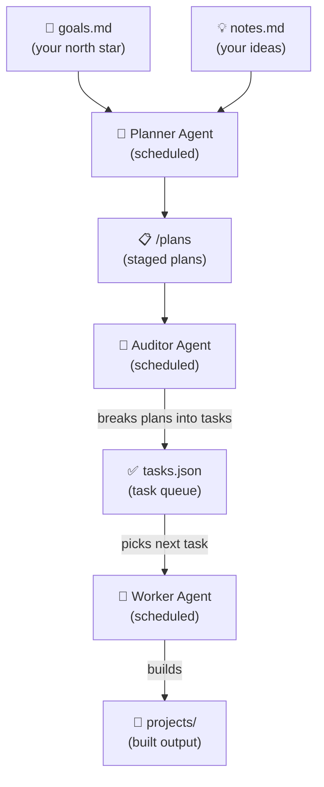

# RawrBot


An autonomous agent workspace. The agent plans its own work daily, executes tasks on a regular schedule, and evolves its understanding of what to build over time.

## How It Works



## 🚀 Getting Started

1. **Clone the repo** and `cd` into it.

2. **Install [Claude Code](https://github.com/anthropics/claude-code)** - the scripts invoke `claude` directly.

3. **Run `/rawr-setup`** in a Claude Code session - it will create all required files with examples and install the launchd agents.

4. **Try it out** - queue your first task and watch it execute:

   ```
   /rawr-add-task build a hello world CLI tool
   /rawr-run-worker
   ```

## 🛠️ Skills

RawrBot operates automatically, but you can also trigger operations manually with the following skills:

| I want to...                       | Use this                     |
| :--------------------------------- | :--------------------------- |
| 💭 Dump a vague idea for later     | Add to `notes.md`            |
| ✏️ Shape an idea into a plan       | `/rawr-add-plan`             |
| ⚡ Queue exact work immediately    | `/rawr-add-task`             |
| 👀 Review and approve staged plans | `/rawr-run-auditor`          |
| 🤖 Trigger the planner manually    | `/rawr-run-planner`          |
| ▶️ Execute a task manually         | `/rawr-run-worker [task-id]` |
| 📊 Check system status             | `/rawr-status`               |
| 📝 Generate a project README       | `/rawr-create-readme`        |
| 🔧 First-time workspace setup      | `/rawr-setup`                |

## 🕹️ Steering the Planning Agent

After intially defining your goals and constraints in `goals.md`, there are three ways to feed work into the agent, from passive to direct:

**1. Drop an idea in `notes.md`** - write it in plain English, the planning agent picks it up on its next tick and converts it into a plan for review:

```
build a CLI tool that summarises my git activity for the week
```

**2. Shape an idea with `/rawr-add-plan`** - interactively refine a rough concept into a structured plan. You can either stage it in `plans/` for batch review or promote it straight to the task queue:

```
/rawr-add-plan build a CLI tool that summarises my git activity for the week
```

**3. Queue work directly with `/rawr-add-task`** - skip the planning stage entirely and add a task straight to `tasks.json`:

```
/rawr-add-task build a CLI tool that summarises my git activity for the week
```

### 📅 Agent Schedules

| Agent   | Mon      | Tue      | Wed      | Thu      | Fri      | Sat    | Sun    |
| :------ | :------- | :------- | :------- | :------- | :------- | :----- | :----- |
| Auditor | 6:30am   | 6:30am   | 6:30am   | 6:30am   | 6:30am   | 6:30am | 6:30am |
| Planner | 7:00am   | -        | -        | -        | 7:00am   | 7:00am | 7:00am |
| Worker  | 7am, 9am | 7am, 9am | 7am, 9am | 7am, 9am | 7am, 9am | hourly | hourly |

The sequencing is intentional: auditor runs at 6:30am to approve any staged plans before the worker fires at 7am. The 9am worker run catches plans generated that same morning (e.g. from the planner on Mon/Fri). On weekends the worker runs every hour, so the turnaround from plan to execution is at most ~90 minutes.

Agents are scheduled via launchd (macOS native Launch Agents). Launch agents are more reliable than cron jobs because and can be easily managed.

```bash
./scripts/launchd.sh install    # Install and load all agents
./scripts/launchd.sh uninstall  # Unload and remove all agents
./scripts/launchd.sh status     # Check which agents are loaded
```

### ☕ Keep Your Mac Awake

Install [Caffeine](https://www.caffeine.app/) with `brew install --cask caffeine`.

Ensure your Mac is plugged in and prevent your Mac from sleeping with:

```bash
caffeinate -s
```

## 📂 Files

| File                      | Purpose                                                                                          |
| :------------------------ | :----------------------------------------------------------------------------------------------- |
| 🎯 `goals.md`             | Agent's north star - what to build, priorities, constraints. Edit freely.                        |
| 💡 `notes.md`             | Your scratchpad - drop ideas here, the agent converts actionable ones to tasks each morning      |
| 📋 `plans/`               | Staged plan files from the planner - review then `/rawr-run-auditor` to extract into tasks.json  |
| ✅ `tasks.json`           | Task queue - populated via `/rawr-run-auditor` or `/rawr-add-task`, executed by the worker agent |
| 📜 `memory/progress.txt`  | Log of completed work                                                                            |
| 🧠 `memory/index.md`      | Long-term agent memory                                                                           |
| 📅 `memory/YYYY-MM-DD.md` | Daily notes - morning plan + session summaries                                                   |
| 🚀 `projects/`            | Agent-created projects live here                                                                 |
| ⏱️ `agents/`              | Plist files for agent scheduling                                                                 |
| 📄 `rawr.log`             | Output from scheduled scripts                                                                    |

## 💰 Token-Saving Strategies

The agent is designed to keep each Claude invocation cheap:

- 🔢 **Queue cap** - new tasks are only generated when fewer than 3 are pending, preventing runaway queue growth
- 🚫 **No `CLAUDE.md`** - the workspace deliberately omits a `CLAUDE.md` file so no extra content is injected into every context window
- ✂️ **Truncated history** - `memory/progress.txt` is injected tail-only (50 lines for execution, 100 for planning), not in full
- 📂 **Projects listing, not contents** - the planner only injects top-level directory names from `projects/`, not file trees or file contents
- ⚡ **Single-shot invocations** - both cron scripts use `claude -p` (non-interactive), so no conversation history accumulates across turns
- 📝 **Concise progress logging** - agents are explicitly instructed to "sacrifice grammar for concision" in `progress.txt`
- 🔍 **`memory/index.md` as index** - only the summary index is injected per tick; full memory files are read on demand, not always loaded
- 🛡️ **Early-exit guards in scripts** - shell scripts check preconditions (e.g. staged plan count) before invoking `claude`, skipping the API call entirely when there is nothing to do
- 📤 **Side-effects offloaded to bash** - Telegram notifications are sent by the script layer using `grep`/`tail` on existing log files; Claude writes a concise log line and the script handles the rest
- 🔧 **Structured operations in scripts, not Claude** - plan parsing and task extraction (`extract-plans.sh`), task appending (`append-task.sh`), and plan listing (`list-plans.sh`) are handled by bash scripts with embedded Python, requiring no Claude invocation
